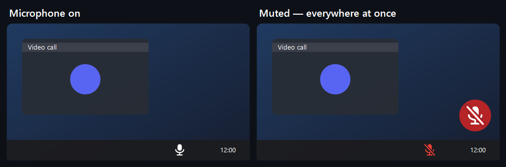
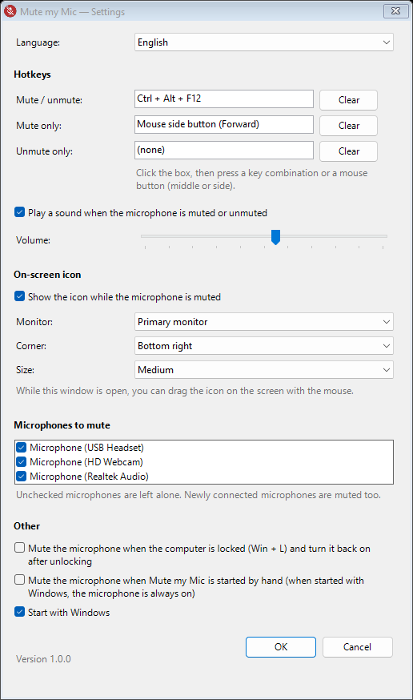
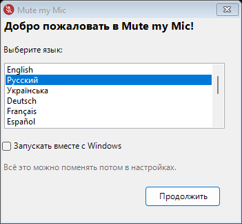
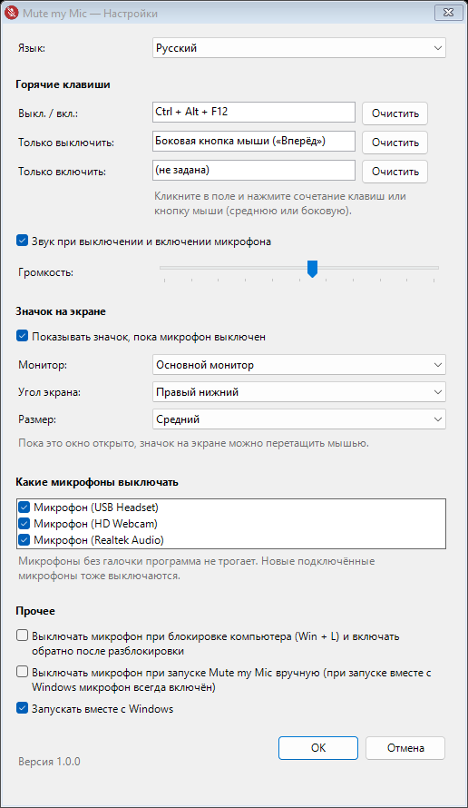

<p align="center">
  
</p>

<h1 align="center">Mute my Mic</h1>

<p align="center">
  <b>One hotkey to mute your microphone everywhere at once</b> — Google Meet, Discord, Teams, Zoom, Telegram, OBS and every other app.<br>
  A tiny Windows tray app. No installer, no account, fully offline.
</p>

<p align="center">
  <a href="https://github.com/RIGIOL/MuteMyMic/releases/latest"></a>
  
  <a href="LICENSE"></a>
</p>

<p align="center">
  <a href="#на-русском">🇷🇺 Описание на русском</a>
</p>

<p align="center">
  
</p>

## Why

Every call app has its own mute button, and they don't know about each other. Mute my Mic flips the switch in **Windows itself** (the same one as *Mute* in Sound settings), so the microphone is silent for every program at the same time — and you always see it.

## Features

- 🎙️ **System-wide mute** of all microphones — or only the ones you pick.
- ⌨️ **Hotkeys or mouse buttons** (middle / side buttons): mute/unmute toggle, plus separate *mute only* and *unmute only*.
- 🔴 **On-screen indicator** while muted: choose the monitor, a corner or drag it anywhere; three sizes.
- 🔔 **Click sound** on mute/unmute, with volume control.
- 🔒 **Mute on lock** (Win + L) and switch back on after unlocking — optional.
- 🔄 **Stays in sync**: notices when the mic is muted or unmuted in Windows or another app; a mic plugged in while muted is muted instantly.
- ✅ **Never leaves you silent by accident**: the PC always starts with the microphones on, and quitting the app turns them back on.
- 🧩 **Command line** for Stream Deck, AutoHotkey or keyboard software: `MuteMyMic.exe --toggle`, `--mute`, `--unmute`.
- 🌍 **13 languages**: English, Русский, Українська, Deutsch, Français, Español, Português, Italiano, Polski, Türkçe, 中文, 日本語, 한국어.
- 🪶 **Tiny and private**: one ~140 KB `.exe`, no admin rights, no network access, no telemetry.

<p align="center">
  
  &nbsp;&nbsp;
  
</p>

## Install

1. Download **`MuteMyMic.exe`** from the [latest release](https://github.com/RIGIOL/MuteMyMic/releases/latest).
2. Put it in any permanent folder (e.g. `Documents\Mute my Mic`) and run it.
3. Pick a language. The icon appears in the tray next to the clock — if you don't see it, click the `^` arrow and drag it onto the taskbar.
4. **Left click** the icon to mute/unmute, **right click** → *Settings*. The default hotkey is **Ctrl + Alt + F12**.

> **"Windows protected your PC"?** The app is not code-signed (certificates cost money), so SmartScreen warns about any new unsigned program. Click **More info → Run anyway**. The code is open, and every release is built by GitHub Actions straight from this repository; a `.sha256` checksum is attached to each release.

## Good to know

- While a program running **as administrator** is in focus, Windows doesn't pass hotkeys to normal apps. Run Mute my Mic as administrator too if you need that.
- The on-screen indicator is not drawn over games in exclusive full-screen mode (borderless/windowed is fine).
- A key or mouse button used as a hotkey stops doing its usual job in other programs while the app is running.
- Settings: `%APPDATA%\MuteMyMic\settings.ini`. Error log (local only): `%APPDATA%\MuteMyMic\error.log`.

## Build from source

Nothing to install — it uses the C# compiler that ships with .NET Framework 4.8 on every Windows 10/11:

```bat
build.bat
```

The result is `bin\MuteMyMic.exe`.

---

## На русском

**Mute my Mic** — маленькая программа для Windows, которая **выключает микрофон во всей системе** по горячей клавише или кнопке мыши — сразу для Google Meet, Discord, Teams, Zoom, Telegram, OBS и любых других программ.

<p align="center">
  
</p>

### Возможности

- 🎙️ Выключает **все** микрофоны в Windows (то же, что «Отключить звук» в параметрах звука) — или только выбранные.
- ⌨️ Горячие клавиши **или кнопки мыши** (средняя, боковые): «вкл./выкл.» (по умолчанию **Ctrl + Alt + F12**), а также отдельные «только выключить» и «только включить».
- 🔴 Значок перечёркнутого микрофона поверх всех окон, пока микрофон выключен: выбор монитора, угла и размера; пока открыты настройки, его можно перетащить мышью куда угодно.
- 🔔 Короткий звук при выключении и включении, с регулировкой громкости.
- 🔒 По желанию: выключать микрофон при блокировке компьютера (Win + L) и включать обратно после разблокировки.
- 🔄 Следит за изменениями извне: если выключить или включить микрофон в Windows или другой программе, значок это покажет; микрофон, подключённый в режиме «выключен», сразу выключается.
- ✅ Компьютер всегда стартует с включёнными микрофонами, а при выходе из программы они включаются обратно.
- 🧩 Команды для Stream Deck, AutoHotkey и программ клавиатур: `MuteMyMic.exe --toggle`, `--mute`, `--unmute`.
- 🌍 13 языков; язык выбирается при первом запуске и меняется в настройках.
- 🪶 Один файл `.exe` (~140 КБ), без установки, без прав администратора, **полностью офлайн** — никаких сетевых запросов и телеметрии.

### Установка

1. Скачайте **`MuteMyMic.exe`** со страницы [последней версии](https://github.com/RIGIOL/MuteMyMic/releases/latest).
2. Положите его в любую постоянную папку (например, `Документы\Mute my Mic`) и запустите.
3. Выберите язык. Иконка появится в трее возле часов — если её не видно, нажмите стрелку `^` и перетащите иконку на панель задач.
4. **Левый клик** по иконке — выключить/включить микрофон, **правый** → «Настройки».

> **Windows пишет «Windows защитила ваш компьютер»?** У программы нет цифровой подписи (она платная), поэтому SmartScreen предупреждает о любой новой неподписанной программе. Нажмите «Подробнее» → «Выполнить в любом случае». Код открыт, а каждую версию собирает GitHub Actions прямо из этого репозитория; к каждому релизу приложена контрольная сумма `.sha256`.

### Полезно знать

- Если активно окно программы, запущенной **от имени администратора**, Windows не передаёт горячие клавиши обычным программам. Выход — запустить Mute my Mic тоже от администратора.
- Значок не виден поверх игр в эксклюзивном полноэкранном режиме (в оконном/безрамочном — виден).
- Пока программа запущена, выбранная клавиша или кнопка мыши работает только для микрофона и не выполняет своё обычное действие в других программах.
- Настройки: `%APPDATA%\MuteMyMic\settings.ini`, журнал ошибок (только на вашем компьютере): `%APPDATA%\MuteMyMic\error.log`.

### Сборка из исходников

Ничего устанавливать не нужно — используется компилятор C#, встроенный в .NET Framework 4.8: запустите `build.bat`, готовый файл — `bin\MuteMyMic.exe`.

## License

[MIT](LICENSE) © RIGIOL
